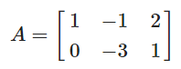
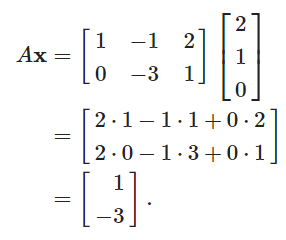
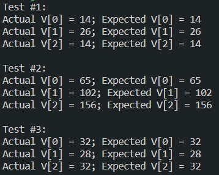
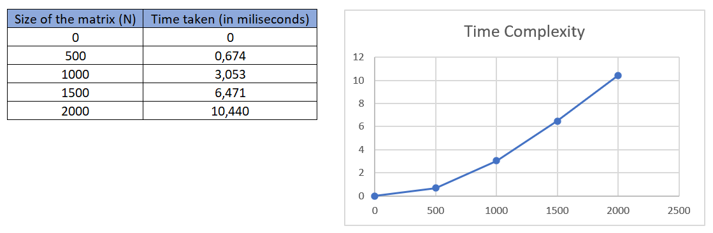
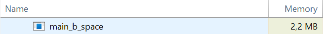
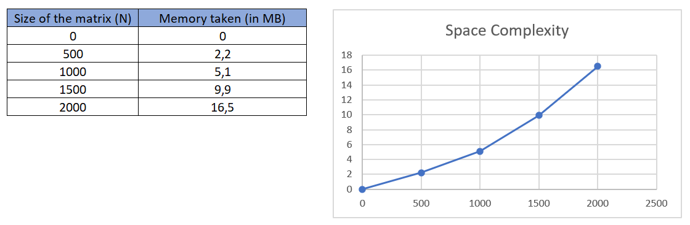

# Matrix Vector Multiplication Benchmark

In this repository, I will do the **matrix vector multiplication** by using C programming language. I will **test** my program whether it produce the correct output or not and also, I will measure the **time complexity** and **space complexity** of the program

## Multiply Matrix To Vector

Before we move further, let's have a look on how to do matrix to vector multiplication without using a code. Assume matrix ***A*** multiplied by vector ***x***, if

and ***x*** = (2, 1, 0), then

## Testing

Now, we will test the code by running it

**Follow the steps below.**

1. [Click here](https://github.com/aubertlenno/matrix-vector-mult-benchmark/archive/refs/heads/main.zip) to download the folder as zip

2. Unzip the .zip file

3. Open Terminal if you are using Linux or macOS or use WSL if you are using Windows

4. Refer to [this link](https://learn.microsoft.com/en-us/windows/wsl/install-manual) on how to install WSL

5. Direct to the "matrix-vector-mult-benchmark" folder using `cd <folder path>`

6. Compile the C file by using `make` 

7. It will produce the executable file named `main_test.out`

8. Now you can run it by using `./main_test.out`

9. Then it will print this

   

So, as seen from the output, the code **runs properly** since the actual value and the expected value is the **same**.

## Benchmarking

Now that the code ran properly, I will show you how to measure the **time complexity** and **space complexity** of the code. But before we move further, let's see the definition of time complexity and space complexity.

### Definition

###### Time Complexity

Time Complexity is defined as the **amount of time taken** by an algorithm to run, as a function of the length of the input. It measures the time taken to execute each statement of code in an algorithm.

###### Space Complexity

Space Complexity refers to the **amount of memory or space** an algorithm takes to run as a function of the length of the input. Space complexity is a way to evaluate the performance of an algorithm.

### Time Complexity

Now, let's measure the time complexity. **Follow the steps below**.

1. [Click here](https://github.com/aubertlenno/matrix-vector-mult-benchmark/archive/refs/heads/main.zip) to download the folder as zip
2. Unzip the .zip file
3. Open Terminal if you are using Linux or macOS or use WSL if you are using Windows
4. Refer to [this link](https://learn.microsoft.com/en-us/windows/wsl/install-manual) on how to install WSL
5. Direct to the "matrix-vector-mult-benchmark" folder using `cd <folder path>`
6. Run `make time; ./main_b_time.out`
7. Then the output will be `Time elapsed with N = 1000 is 0.003053 s`

This indicates that, with N = 1000, the time taken to calculate the **multiplication of NxN matrix to N-vector** is 0.003053 second

I made a graph indicating the time complexity as the N increases.

### Space Complexity

Then, to measure the time complexity. I'm using Windows for the step-by-step tutorial.

**Follow the steps below (I use N = 500)**.

1. [Click here](https://github.com/aubertlenno/matrix-vector-mult-benchmark/archive/refs/heads/main.zip) to download the folder as zip
2. Unzip the .zip file
3. Search "Command Prompt" and run it
4. Direct to the "matrix-vector-mult-benchmark" folder using `cd <folder path>`
5. Open "Task Manager"
6. Check the memory taken by the program. It will look like this.

This indicates that, with N = 500, the **memory taken in my computer to run the program** is 2.2 Mega Byte

I made a graph indicating the time complexity as the N increases.

